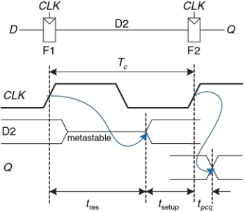

Введём обозначения терминов для двух типов схем:
|Комбинационная схема|Синхронная последовательностная схема|
|-|-|
| tpd - задержка распространения|tpcq - задержка распространения|  
| tcd - задержка реакции|tccq - задержка реакции|
||tsetup - время предустановки|
||thold - время удержания|
||tsetup + thold - апертурное время|
|||
|||

**Ограничение периода** тактового сигнала синхронной последовательностной схемы:
$$ T_c \geq t_{pcq} + t_{pd} + t_{setup} $$

Откуда получаем **ограничение времени предустановки**:
$$ t_{pd} \leq T_c - (t_{pcq} + t_{setup}) $$
$ (t_{pcq} + t_{setup}) $ - **потери на упорядочивание (sequencing overhead)**

Далее
$$ t_{ccq} + t_{cd} \geq t_{hold} $$

Откуда получаем **ограничение времени удержания**:
$$ t_{cd} \geq t_{hold} - t_{ccq} $$

Теперь те же формулы с учётом **времени расфазировки tskew**:
$$ T_c \geq t_{pcq} + t_{pd} + t_{setup} + t_{skew} $$

Откуда получаем **ограничение времени предустановки**:
$$ t_{pd} \leq T_c - (t_{pcq} + t_{setup} + t_{skew}) $$

Далее
$$ t_{ccq} + t_{cd} \geq t_{hold} + t_{skew} $$

Откуда получаем **ограничение времени удержания**:
$$ t_{cd} \geq t_{hold} - t_{ccq} + t_{skew} $$

### Время разрешения
Если вход триггера изменяется в произвольный момент цикла тактового сигнала, то время разрешения, $t_{res}$, необходимое для перехода в стабильное состояние, также является случайной величиной. Если вход изменяется вне апертурного времени, то $t_{res} = t_{pcq}$. Но если произойдет изменение входа в апертурное время, tres может быть существенно больше.

Теоретическое и экспериментальное рассмотрение показывает, что вероятность того, что время разрешения превышает некоторое время $t$, экспоненциально падает с ростом $t$:
$$P(t_{res}>t) = \frac{T_0}{T_c}e^{-t/\tau}$$
где $T_c$ - пертод тактового сигнала, $T_0$ и $\tau$ - характеристики триггера.

Таким образом, если вход бистабильного устройства, такого как триггер,
изменяется в течении апертурного времени, его выход может некоторое
время находиться в метастабильном состоянии, прежде чем перейти в
стабильное состояние 0 или 1.

### Синхронизаторы
Наличие асинхронных входов цифровой системы, которые принимают информацию из внешнего мира, неизбежно. Например, сигналы, которые формирует человек, асинхронны. Такие асинхронные входы, если к ним относиться небрежно, могут привести к появлению метастабильных состояний в системе, что приведет к ее непредсказуемым отказам, которые крайне сложно отследить и исправить. При наличии асинхронных входов- проектировщик системы должен обеспечить достаточно малую вероятность появления метастабильных напряжений.

Чтобы гарантировать корректность логических уровней, все асинхронные входы должны
пройти через *синхронизаторы*

На рисунке показано, как из двух триггеров можно построить простой синхронизатор. Триггер F1 фиксирует значение входного сигнала D по переднему фронту тактового сигнала CLK. Если D изменяется в апертурное время, его выход D2 на некоторое время может стать
метастабильным. Если период тактового сигнала достаточно велик, то с высокой вероятностью до конца периода D2 придет к корректному логическому уровню. Триггер F2 затем фиксирует D2, который теперь стабилен, и формирует корректный выходной сигнал.
Мы говорим о сбое синхронизатора, если его выход Q станет метастабильным. Это может произойти, если D2 не успеет прийти к корректному состоянию до начала времени предустановки триггера F2, то есть когда $t_{res}>T_c–t_{setup}$. Вероятность сбоя для одиночного изменения входа в произвольное время равна:
$$P(failure) = \frac{T_0}{T_c}e^{\frac{T_c-t_{setup}}{\tau}}$$
Вероятность сбоя, $P(failure)$, есть вероятность того, что выход Q будет метастабильным после однократного изменения входа D. Если D изменяется один раз за секунду, то вероятность сбоя за одну секунду будет просто $P(failure)$. Однако, если D изменяется N раз за секунду, то вероятность ошибки за секунду будет в N раз большей:
$$P(failure)/sec = N\frac{T_0}{T_c}e^{\frac{T_c-t_{setup}}{\tau}}$$
Надежность системы обычно измеряют *средним временем наработки на отказ* (*mean time between failures, MTBF*). Как понятно из названия, MTBF – это среднее время между отказами системы. Эта величина обратна вероятности сбоя системы за любую заданную секунду:
$$MTBFP=\frac{1}{P(failure)/sec}=\frac{T_ce^{-\frac{T_c-t_{setup}}{\tau}}}{NT_0}$$
